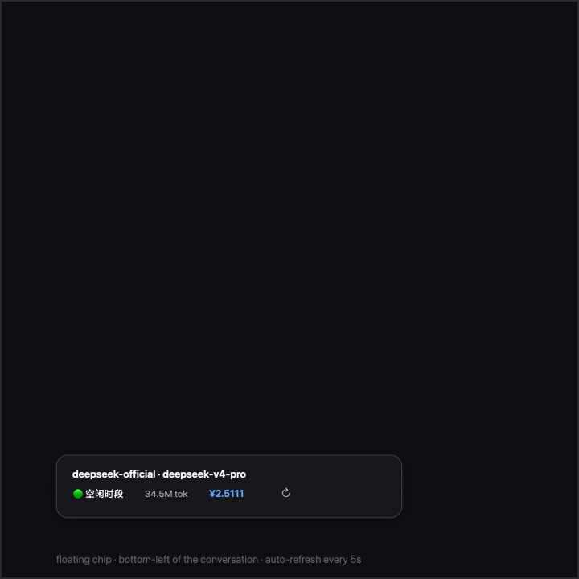

# dsh-command-cost

A [DeepSeek Harness](https://github.com/deepseek-ai/deepseek-harness) (dsh) profile
plugin: the `/cost` slash command plus a floating web UI cost chip showing the
current session's **model, cumulative token usage, billing period (🔴 peak /
🟢 off-peak) and estimated monetary cost** — with time-of-day pricing that
switches over automatically on a configured effective date.

[中文文档](README.md)

## Features

Type `/cost` in any interactive surface that composes `@deepseek-ai/dsh-commands`
(the shipped Web UI does):

```
Session token usage & estimated cost

  model:   deepseek-official · deepseek-v4-pro
  period:  🟢 空闲时段 · 北京时间 02:38 · 现行价：原价（分时价自 2026-08-17T00:00:00+08:00 起生效）
  prices:  deepseek-v4-pro
    原价:   input 3 / cache-read 0.025 / output 6 (cache-write = input 3) ¥/1M
    高峰价: input 9 / cache-read 0.3 / output 27 (cache-write = input 9) ¥/1M
    空闲价: input 4.5 / cache-read 0.15 / output 13.5 (cache-write = input 4.5) ¥/1M

  input (uncached)            6,000,000 tok
  cache read                  4,000,000 tok
  ...
  total                      10,600,000 tok  ¥45.1500

  cost by tier:
    原价              1,100,000 tok  ¥3.6000
    高峰价             2,200,000 tok  ¥23.4000
    空闲价             7,300,000 tok  ¥18.1500
```

On web profiles the package's `dsh.client` half also renders a **floating chip**
at the bottom-left of the page:

```
deepseek-official · deepseek-v4-pro
🟢 空闲时段   34.5M tok   ¥2.5111   ↻
```




- **Refresh**: manual ↻ button + a 5-second auto-refresh + an immediate refetch
  whenever the `tokenUsage` projection changes.
- **Draggable**: press and drag the chip anywhere (clamped to the viewport); the
  position is remembered in the browser and survives refreshes; double-click the
  chip to reset it to the bottom-left corner.
- The chip renders through a React portal to `document.body` with theme-aware
  colors (`--dsw-alias-*` variables), so it follows dark/light switching.

### How the numbers work

- **Model** comes from the receiving agent's `options` (provider · model); the
  HTTP route falls back to the session's folded `request/header` for persisted
  sessions without a live agent.
- **Period badge** is computed live in Beijing time (`Asia/Shanghai` by
  default): 🔴 peak during `9:00–12:00` and `14:00–18:00`, 🟢 off-peak otherwise
  (half-open ranges).
- **Time-of-day billing**: every durable session event carries a Unix `time`,
  so each usage sample is priced at the tier of the moment it happened —
  original / peak / off-peak — instead of everything being priced at "now".
  Sessions spanning tiers show a per-tier breakdown.
- **Effective date**: before `peakEffectiveAt` (default
  `2026-08-17T00:00:00+08:00`) everything bills at the original prices; on and
  after it, requests bill at their own period's prices. Nothing to change when
  the date arrives.
- **Usage source**: a direct fold of `session.events` with the exact
  `(turn, step)` sample-replacement rule of the dsh-token-meter `tokenUsage`
  projection; falls back to the projection snapshot when the log has no usage.
- **Cache write** bills at each tier's input price (DeepSeek convention), and
  can be overridden per row.

## Built-in price table (CNY per 1M tokens)

| Model | Tier | Input (cache hit) | Input (cache miss) | Output |
|---|---|---:|---:|---:|
| deepseek-v4-flash | original | 0.02 | 1.00 | 2.00 |
| deepseek-v4-flash | peak | 0.10 | 3.00 | 9.00 |
| deepseek-v4-flash | off-peak | 0.05 | 1.50 | 4.50 |
| deepseek-v4-pro | original | 0.025 | 3.00 | 6.00 |
| deepseek-v4-pro | peak | 0.30 | 9.00 | 27.00 |
| deepseek-v4-pro | off-peak | 0.15 | 4.50 | 13.50 |
| deepseek-chat | original only | 0.5 | 2 | 3 |
| deepseek-reasoner | original only | 1 | 4 | 16 |

Peak hours: Beijing time 9:00–12:00 and 14:00–18:00 (half-open); everything
else is off-peak. Cache-write price = input (cache-miss) price.

## Configuration (all optional)

Override in the profile's `cordis.patch.yml`:

```yaml
- id: command-cost
  config:
    currencySymbol: '¥'               # default ¥
    exchangeRate: 0.14                # optional: also shows an ≈ USD line
    timeZone: 'Asia/Shanghai'         # time zone the billing periods use
    peakRanges: [[9, 12], [14, 18]]   # peak hours, half-open [start, end)
    peakEffectiveAt: '2026-08-17T00:00:00+08:00'   # time-of-day prices take effect (ISO 8601)
    perMTok:                          # override the fallback row
      input: 2
      cacheRead: 0.5
      output: 3
    models:                           # exact match by model id or provider name
      deepseek-v4-pro:
        input: 3
        cacheRead: 0.025
        output: 6
        peak: { input: 9, cacheRead: 0.3, output: 27 }
        offPeak: { input: 4.5, cacheRead: 0.15, output: 13.5 }
```

Row resolution: `models[model]` → `models[provider]` → `perMTok` (fallback).
Rows without `peak`/`offPeak` always bill at original prices.

## Repository layout

```
.
├── index.js              # host plugin: /cost command + /cost-panel/data route + pricing fold
├── client.js             # client bundle (dsh.client, hand-written, no build step)
├── cordis.patch.yml      # mount-row example (copy into a profile patch or reference via --patch)
├── scripts/verify.mjs    # offline verification (real cordis/loader/commands + React SSR assertions)
├── package.json          # repo root IS the package: dsh.client, exports, files, scripts
├── README.md (Chinese, main) / README.en.md (this file)
└── LICENSE
```

## Installation

1. Install this repo as a profile dependency (either way):

   ```sh
   # A: official path (pnpm forwarder; keeps package.json/lockfile consistent)
   dsh plugin --profile web add "file:/absolute/path/to/ds-plugins"
   #    (or `add dsh-command-cost` once published to npm)

   # B: manual copy
   mkdir -p "$DSH_HOME/profiles/web/node_modules"
   cp index.js client.js package.json "$DSH_HOME/profiles/web/node_modules/dsh-command-cost/"
   ```

   ⚠️ Option A installs a copy of the files at that moment; after editing the
   source, re-sync (`dsh plugin --profile web install` or copy the files again).

2. Add the row to the profile's patch file
   (`$DSH_HOME/profiles/web/cordis.patch.yml`) — the repo's `cordis.patch.yml`
   is exactly this example with every config key commented:

   ```yaml
   - insert:
       - id: command-cost
         name: dsh-command-cost
   ```

3. Restart the profile (`dsh web` restart required — plugin rows are read at
   boot; the web profile has plugin HMR disabled).

4. Verify: `dsh --profile web --dump-config` shows the `command-cost` row; the
   chip appears bottom-left and `/cost` works in the session.

## Zero-dependency note

The host plugin imports no third-party modules: `ctx.commands`,
`ctx.tokenMeter`, and `ctx.get('sessionProjections')` are injected by Cordis at
load time, so it resolves even from a profile whose node_modules contains
nothing but this package. The client bundle only uses the platform seeds
(`react`, `react/jsx-runtime`, `react-dom`).

## Privacy note

The `/cost-panel/data` HTTP route answers for any session id it is asked
about. The dsh web server binds `127.0.0.1` by default, so the route is only
reachable from the same machine; if a deployment binds `0.0.0.0`, anyone who
can reach the port can read token/cost aggregates for guessable session ids.
Do not expose the port to an untrusted network.

## Development

`scripts/verify.mjs` boots the real cordis + loader + `dsh-commands` + React 18
(including `react-dom/server` SSR assertions) from a dsh installation, resolves
the plugin the way a profile does, and covers: period/tier pure functions
(11:59/12:00 boundaries, time zones), the three-tier time-of-day fold, sample
dedup, projection fallback, argument rejection, config hot update, the data
route JSON, and client-bundle loading/rendering. The dsh installation is
located via `$DSH_INSTALL`, then `dsh` on PATH, then a machine-specific
fallback.

```sh
npm install          # installs @deepseek-ai/dsh as a devDependency (for verification)
npm run check        # syntax check
npm run verify       # full offline verification (also runs in CI)
```

## License

MIT
